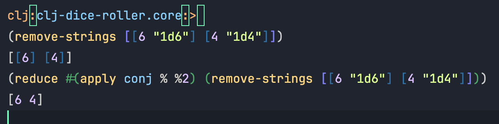

# Data structures

- **Map e MapV**: map retorna uma lazy collection, e mapv um vector. `GPT`
  - Use vector quando:
    Você precisa de acesso rápido por índice.
    A coleção é finita e pequena o suficiente para caber na memória.
    Deseja manipular elementos de forma estruturada e previsível.
  - Use lazy sequence quando:
    Você está lidando com coleções grandes ou infinitas.
    Deseja economizar memória e evitar cálculos desnecessários.
    Está processando fluxos de dados que podem ser consumidos em partes.

-----

- **Parsear uma rolagem** como `"2d6"` ou `"1d4" "2d6"...` e retornar a quantidade de dados e qual o dado
    Recebo a rolagem ou rolagens e para cada uma *(mapv, executa uma função para cada param e retorna um array)* eu retiro a string `#"d"` e sobrs `["2" "6"]`. Depois para cada elemento desse faço o **parse para int** (pq é uma string)

    ```clojure
    (defn parse-rolls
        [& args]
        (mapv (fn [roll]
                (->> (str/split roll #"d")
                    (mapv #(Integer/parseInt %))))
                args))

-----

- **Remover strings de uma coleção** com coleções dentro:
    Tento remover primeiro com o remove, se ele encontrar uma coleção `(if (coll? x))` eu chamo a mesma função para remover a string da coleção, se tiver outra coleção dentro por aí vai... o **`%`** represta o primeiro valor que ele recebe da coleção (ou o valor ou um [])

    ```clojure
    (defn remove-strings
        [rolls]
        (mapv #(if (coll? %) (remove-strings %)  %)
                (remove string? rolls)))

PS: o `(remove string? rolls)` retorna a coleção normal se não tiver nenhuma string para remover

-----

- **Reduce**: recebe uma `(fn [acc value])`, initial value e a coleção, se não receber um initial-value vai ser o valor inicial ou padrão da coleção. `acc` se refere a acumuluator que é o valor atualizado da iteração (ele *"acumula"* o valor da iteração) enquanto o value é o valor atual da iteração

    ```clojure
    (reduce (fn [acc x] (+ acc x)) 
            0 
            [1 2 3 4 5]) ;; => 15

- Iteração 1: `acc = 0`, `x = 1` → Retorna `0 + 1 = 1`.

- Iteração 2: `acc = 1`, `x = 2` → Retorna `1 + 2 = 3`.
- Iteração 3: `acc = 3`, `x = 3` → Retorna `3 + 3 = 6`.
- Iteração 4: `acc = 6`, `x = 4` → Retorna `6 + 4 = 10`.
- Iteração 5: `acc = 10`, `x = 5` → Retorna `10 + 5 = 15`.

-----

- **Roll multiple dices**, como `2d4 + 1d8`:

    1. Para cada argumento que recebe `"2d4" "1d8"`, ele vai primeiro fazer o parse para retornar apenas os números `[2 4]` e `[1 8]` e fazer a rolagem para cada um. O **apply** "desempacota" o value que é um array `[]` em argumentos separados então invés de passar um array estou passando cada elemento como um param diferente, o `roll` espera `[amount dice & {:keys [modifier] :or {modifier 0}}]` (só os dois primeiros feitos)
    2. Recebe o valor como `[[[2 4] "2d4"] [[6] "1d8"]]`. Quero juntar os resultados das rolagens e seu respectivo dado em um único array para ficar mais fácil de manipular depois, então fica assim -> `[[2 4 "2d4"] [6 "1d8"]]` (mais simples)

    ```clojure
    (defn roll-multiple2
        [& args]
        (->> (reduce (fn [acc dice]
                        (let [value (-> dice parse-rolls first)
                              roll (apply roll value)]
                        (conj acc [roll dice])))
                    [] args)
            (mapv #(into (first %) [(second %)])))) ;;*  junta os resultados de cada dado em um único array -> [[2 4 3 "3d4"] [5 "1d6"]]

-----

- **Somar as rolagens**, `2d4 + 1d8 = 10 [4 2 "2d4"] [4 "1d8"]`: Preciso remover os strings da coll que seriam os dados `"2d4"  "1d8"` para juntar **apenas** os resultados das rolagens num único array. O `print-rolls` é só o que vou retornar  `[[2 4 "2d4"] [6 "1d8"]]`

    1. **remove-strs**: removo os dados das rolagens ->  `[[2 4] [6]]`
    2. **rolls-results**: basicamente junto os arrays em um único só, para ter só os resultados das rolagems -> `[2 4 6]` para poder somar eles no `(reduce + rolls-results)`
    3. **print-rolls**: só a forma como vou apresentar as rollagnes com os dados, pq se tivesse só um elemento ele retornava dois arrays um dentro do outro `[[2 4 "2d4"]]` e nesse caso queria só **um** array retornado

    ```clojure
    (defn sum-multiple-rolls
        [rolls]
        (let [remove-strs  (remove-strings rolls)
                rolls-results (reduce #(apply conj % %2) remove-strs)
                print-rolls (if (-> rolls count (= 1)) (first rolls) rolls)] 
            [(reduce + rolls-results) print-rolls]))

- numa *lambda*, o `%` representa o primeiro argumento passado para ela e `%2` o segundo elemento da função *lambda*

-----

- Modifier on roll-multiple without schema

    ```clojure
    (defn roll-multiple
      [& args]
      (let [optional? (-> args last map?) ;;TODO: change this check when add schemas, checo se o ultimo arg é um mapa
              optional-args (when optional? (last args));;* se for um mapa o ultimo arg, quer dizer que tem o :modifier
              regular-args (if optional? (butlast args) args);;* se tiver o optional? eu pego todos os elementos exceto o último dos args, se não passo o plain args
              {:keys [modifier]} optional-args];;* pego o último arg, que é o :modifier
          (print modifier)
      (-> (->> (reduce (fn [acc dice]
                          (let [parsed-dice (parse-roll dice)
                              roll-result (apply roll parsed-dice)]
                          (conj acc [(get-roll-value roll-result) dice])))
                      [] regular-args)
              (mapv #(into (first %) [(second %)])))
          (sum-multiple-rolls {:modifier modifier}))))
          
